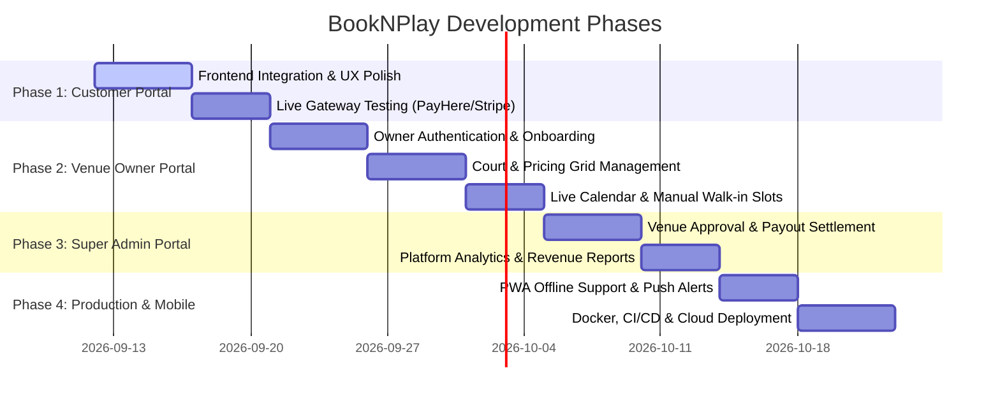

# 🗺️ BookNPlay Project Roadmap & System Blueprint

---

## 📌 1. Project Overview & Architecture

**BookNPlay** is a multi-sport venue discovery, court booking, and facility management platform (for Football, Futsal, Badminton, Tennis, Cricket, Basketball, Swimming, etc.).

```
┌──────────────────────────────────────────────────────────────────────────┐
│                             CLIENT LAYER                                 │
│                                                                          │
│  [ Customer Web App ]       [ Venue Owner Portal ]    [ Admin Dashboard ]│
│  React + Vite + Tailwind    React + MUI (Upcoming)    React (Upcoming)   │
│  Zustand + React Query                                                   │
└────────────────────────────────────┬─────────────────────────────────────┘
                                     │ HTTPS / REST API / JWT
┌────────────────────────────────────▼─────────────────────────────────────┐
│                          SPRING BOOT BACKEND                             │
│                                                                          │
│  ┌───────────────────────┐  ┌───────────────────────┐  ┌───────────────┐ │
│  │ Public Venue & Slot   │  │ Customer Booking &    │  │ Security &    │ │
│  │ Discovery Controller  │  │ Hold Engine           │  │ JWT Auth      │ │
│  └───────────────────────┘  └───────────────────────┘  └───────────────┘ │
│  ┌───────────────────────┐  ┌───────────────────────┐  ┌───────────────┐ │
│  │ Payment Gateways &    │  │ SMS & Email           │  │ Maintenance & │ │
│  │ Webhook Engine        │  │ Notification Engine   │  │ Blocked Slots │ │
│  └───────────────────────┘  └───────────────────────┘  └───────────────┘ │
└────────────────────────────────────┬─────────────────────────────────────┘
                                     │ JPA / Hibernate
┌────────────────────────────────────▼─────────────────────────────────────┐
│                          DATABASE & STORAGE                              │
│                                                                          │
│  [ PostgreSQL / MySQL Database ]           [ S3 / Cloudinary Media ]     │
│  (Venues, Courts, Bookings, Payments, Users, Reviews, Invoices)          │
└──────────────────────────────────────────────────────────────────────────┘
```

---

## 📂 2. Frontend Architecture Explained (What each JS/JSX file does)

### 🔹 API Layer (`src/api/`)
- `lib/axios.js`: Central HTTP client configured with baseURL `http://localhost:8080/api/v1`. Automatically attaches JWT `Bearer` token to headers and transparently handles 401 token refresh queue.
- `api/auth.js`: Endpoints for customer login, customer registration, token refresh, logout, and fetching current authenticated profile (`/customer/auth/*`).
- `api/public.js`: Public endpoints for venue search, filtering by sport & location, venue detail fetching, and real-time court availability matrix (`/public/*`).
- `api/bookings.js`: Customer booking operations—creating a booking hold, fetching upcoming/history bookings, booking cancellation, and viewing booking details (`/customer/bookings/*`).
- `api/payments.js`: Payment initiation, payment gateway checkout links, and status polling (`/customer/payments/*`).

### 🔹 State & Hooks (`src/stores/` & `src/hooks/`)
- `stores/authStore.js`: Zustand store with persistent local storage caching authentication state (`user`, `accessToken`, `refreshToken`, `isAuthenticated`).
- `hooks/useAuth.js`: Encapsulates login, registration, and logout mutations with notifications (Sonner toasts) and automatic navigation.
- `hooks/useVenues.js`: TanStack React Query hooks for cached venue listings, sport types, venue details, and real-time slot availability.
- `hooks/useBookings.js`: React Query hooks for fetching user bookings, creating reservation holds, cancellation, and payment status checks.

### 🔹 Utilities & Theme (`src/utils/` & `src/theme/`)
- `utils/formatters.js`: Formatting currency (`LKR`), dates (`ddd, D MMM YYYY`), time strings (`hh:mm A`), and slot duration ranges.
- `theme/muiTheme.js`: Custom Material UI theme harmonized with Tailwind CSS brand colors (Navy `#061032`, Lime `#84cc16`, Pure White `#ffffff`).

### 🔹 Customer Pages & Flow (`src/pages/`)
1. **`HomePage.jsx`**: Hero search bar (Sport + Location + Date), interactive sports category carousel, featured venues, promo cards, and partner CTA.
2. **`SearchResultsPage.jsx`**: Filterable venue list (sport, city/area, price range, amenities), sort options, and empty states.
3. **`VenueDetailPage.jsx`**: Venue photo gallery, overview, address, operating hours, amenities, court list, and quick slot booking CTA.
4. **`ChooseSlotPage.jsx`**: 7-day horizontal date strip, court selector tabs, real-time availability grid (Available / Booked / Selected), and sticky bottom checkout bar.
5. **`CheckoutPage.jsx`**: Customer contact info verification, payment option selection (Full payment vs. 30% Deposit), price breakdown, hold timer, and cancellation policy.
6. **`PaymentReturnPage.jsx`**: Payment verification state machine (Pending / Polling &rarr; Success with reference &rarr; Failed / Retry).
7. **`BookingDetailPage.jsx`**: Complete booking details, QR / reference code, venue contact, cancellation modal, and receipt printing.
8. **`account/*`**:
   - `UpcomingBookingsPage.jsx`: Active bookings with countdown and directions.
   - `BookingHistoryPage.jsx`: Past bookings with invoice download and rebooking.
   - `ProfilePage.jsx`: User info, phone verification, and password change.
   - `FavouritesPage.jsx`: Saved bookmarked venues.
   - `PrivacyPage.jsx`: Data controls and notification preferences.
   - `HelpPage.jsx`: FAQ accordions and customer support contact.

---

## 📊 3. Current Progress Summary

| Area | Status | Notes |
|---|---|---|
| **Spring Boot Backend Entities & DB** | ✅ Completed | 16 entities (User, Customer, Venue, Court, Booking, Payment, Sport, etc.) |
| **Backend REST Controllers** | ✅ Completed | Customer Auth, Bookings, Payments, Public Venue Discovery, Availability, Webhooks |
| **Customer Web Scaffold & UI System** | ✅ Completed | React + Vite + Tailwind + MUI + Zustand + React Query configured |
| **Customer End-to-End User Journeys** | ✅ Completed | 8 primary pages built and connected to API client |
| **Build & Compilation Health** | ✅ Verified | `npm run build` succeeds with zero errors |

---

## 🚀 4. Detailed Project Roadmap



---

### 🔹 Phase 1: Customer Web App Polishing & Gateway Integration *(Immediate)*
- [x] **Scaffold & UI**: Full responsive UI with Navy/White/Lime brand design.
- [x] **Build Fixes**: Cleaned syntax errors, export alignment, and Vite bundle validation.
- [ ] **End-to-End API Integration Testing**: Connect frontend to live backend running on `localhost:8080`.
- [ ] **Payment Gateway Sandbox**: Connect payment gateway (e.g. PayHere, Stripe, or IPG) with automated webhook verification (`/api/v1/webhook/payment`).
- [ ] **SMS Notifications**: Connect Twilio or local SMS gateway for instant OTP & booking confirmation alerts.

---

### 🔹 Phase 2: Venue Owner / Partner Portal *(Next)*
- [ ] **Partner Registration & Venue Onboarding**: Multi-step wizard to register venue, upload court photos, set GPS coordinates, and add facilities.
- [ ] **Dynamic Court & Pricing Configuration**:
  - Regular peak vs. off-peak hourly pricing.
  - Weekend pricing multipliers.
  - Custom operating hours per day.
- [ ] **Interactive Management Calendar**:
  - Live calendar grid showing booked, held, and available slots.
  - Add offline walk-in bookings directly from the dashboard.
  - Maintenance window blockout feature (e.g., turf cleaning, court repair).
- [ ] **Earnings & Payout Dashboard**: Breakdown of daily bookings, gross revenue, platform commission, and payout history.

---

### 🔹 Phase 3: Super Admin Portal
- [ ] **Venue Approval & KYC Verification**: Review and approve newly registered venues before they go live on search.
- [ ] **User & Customer Management**: Manage customer accounts, review reports, and handle refunds or disputes.
- [ ] **Financial Settlements**: Commission calculation, automatic invoice generation, and bank payout processing.
- [ ] **Platform Analytics**: Total GMV (Gross Merchandise Value), booking frequency heatmaps, most popular sports by region.

---

### 🔹 Phase 4: Advanced Features & Mobile Optimization
- [ ] **PWA & Mobile Push Notifications**: Push alerts for slot reminder (2 hours before game), weather alerts, and special offers.
- [ ] **Community & Matchmaking ("Need Players")**: Allow players to create open matches and find nearby players/opponents to join games.
- [ ] **Customer Reviews & Ratings**: Post-game review submission with photos and court condition ratings.
- [ ] **Real-time WebSockets**: Instant slot lock updates so multiple customers browsing the same court see live availability without refreshing.

---

### 🔹 Phase 5: Production Deployment & DevOps
- [ ] **Backend Containerization**: Dockerfile + `docker-compose.yml` for Spring Boot, PostgreSQL, and Redis.
- [ ] **Frontend Hosting**: Deploy Vite build to Vercel / Netlify / AWS CloudFront.
- [ ] **Backend Hosting**: Deploy to AWS EC2 / DigitalOcean / Render with SSL (Let's Encrypt).
- [ ] **Database Backup & Monitoring**: Daily automated database snapshots and error tracking (Sentry).
